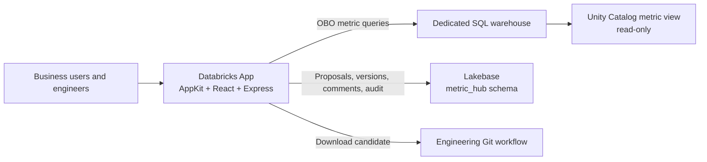

# Databricks Apps POC: Metric View Collaboration Hub

This repository contains a Databricks App proof of concept for coordinating changes to Unity Catalog metric views. It gives business stakeholders and engineers a shared place to discover governed metrics, describe requested changes in business language, discuss proposals, review versions, and produce an engineering-ready SQL/YAML artifact.

The POC explores how Forward Deployed Engineers can use Codex, Databricks agent skills, the Databricks CLI, AppKit, and Lakebase to move from a short product seed to a deployed application while preserving governance and source control.

## The problem

Metric views define important business KPIs, but business users should not need Unity Catalog write access or knowledge of metric-view SQL and YAML syntax to propose improvements. Engineers need enough structured context, acceptance criteria, history, and review evidence to implement those changes safely.

This app separates those responsibilities:

- Business users and reviewers work with guided forms and comments.
- Published Unity Catalog metric views remain read-only.
- Engineers receive a deterministic artifact for their normal Git review and deployment process.
- Application workflow data remains in an app-owned Lakebase schema.

## Current POC capabilities

- Browse live Auto Retail metrics from `hawaii_prod.testing.vw__metrics_test`.
- Query governed data with the signed-in user's on-behalf-of authorization.
- Create structured proposals with dimensions, measures, business context, and acceptance criteria.
- Persist proposals, immutable versions, comments, and audit events in Lakebase.
- Move proposals through draft, review, approval, export, and publication-record states.
- Assign authenticated users to `reviewer` or `admin` application roles.
- Restrict proposal acceptance to configured admins in both the UI and server API.
- Download a deterministic SQL/YAML candidate without writing to Unity Catalog.

## Architecture



The deployed app uses these dedicated development resources:

| Resource           | Value                                  |
| ------------------ | -------------------------------------- |
| Databricks profile | `hawaii-dev-workspace`                 |
| App                | `metric-view-hub`                      |
| SQL warehouse      | `metric-view-hub-dev`                  |
| Lakebase project   | `projects/metric-view-hub`             |
| Metric view        | `hawaii_prod.testing.vw__metrics_test` |

## Security and governance

- Metric queries use OBO execution, so Unity Catalog applies the signed-in user's permissions.
- The app service principal owns the `metric_hub` Lakebase schema used for collaboration state.
- The app does not create, replace, or drop Unity Catalog metric views.
- Unlisted authenticated users default to `reviewer`.
- Emails configured in `APP_ADMIN_EMAILS` receive the `admin` role and can accept proposals.
- The server returns `403` for reviewer attempts to call the approval transition directly.

The email allowlist is suitable for this small POC. A later production design can resolve roles from Databricks groups instead.

## Prepare a macOS or Windows workstation

From the repository root, run the shared setup check in macOS Terminal or Windows Git Bash:

```sh
bash ./setup.sh --check
bash ./setup.sh --check --profile "YOUR_PROFILE"
```

Select your own profile from the first report. Use `--install` for guided missing-tool repairs, or `--install --yes` only when unattended installation is permitted. Windows requires Git Bash first; PowerShell users can keep PowerShell for other development commands. Keep `scripts/setup-json.cjs` with the script.

See the [workstation setup guide](./dapps-env-setup.md) for bootstrap instructions, required checks, manual fallbacks, and exit codes. Setup does not install app dependencies, create `.env`, choose an SDD framework, or provision/deploy resources. An automated pass still leaves manual integration and project checks. macOS check mode has been exercised; live Windows and real installer verification remain pending.

## Start and stop the deployed POC

The app is deliberately stopped outside development sessions and demos to avoid continuous app-compute charges.

```sh
# Start the last successful deployment.
databricks apps start metric-view-hub --profile hawaii-dev-workspace

# Confirm that app_status is RUNNING and compute_status is ACTIVE.
databricks apps get metric-view-hub --profile hawaii-dev-workspace -o json

# Stop app compute when the session ends.
databricks apps stop metric-view-hub --profile hawaii-dev-workspace
```

App URL: <https://metric-view-hub-4192082222593323.3.azure.databricksapps.com>

Starting the app restores its last successful deployment and existing Lakebase data. It does not require a new deployment.

## Run the full application locally

The client and API support a local hot-reload loop backed by an isolated developer schema in the existing development Lakebase project:

```sh
cd metric-view-hub
databricks apps run-local --entry-point app.local.yaml --profile hawaii-dev-workspace --env METRIC_HUB_SCHEMA=metric_hub_local_roberto --env LOCAL_DEV_EMAIL=roberto.delgado@servco.com
```

Open <http://localhost:8001>. See [`metric-view-hub/README.md`](./metric-view-hub/README.md) for the one-time `.env` setup, identity behavior, and local-versus-deployed data boundary.

## Validate the application locally

From `metric-view-hub`:

```sh
npm install
npm run typegen -- --wait
npm run format
npm run lint
npm run typecheck
npm test
npm run build
databricks apps validate --profile hawaii-dev-workspace
```

## This repository's planning workflow

FDEs choose their own SDD framework. This repository uses Reffy; it is not a shared workstation prerequisite and `setup.sh` does not check or install it.

Repository planning tools use pnpm independently of the npm-managed application in `metric-view-hub/`. From the repository root:

```sh
pnpm install --frozen-lockfile
pnpm exec reffy init
pnpm exec reffy doctor
pnpm exec reffy validate
```

Start with [`AGENTS.md`](./AGENTS.md) and the populated [project context](./.reffy/reffyspec/project.md). Reffy maintains ideation artifacts, current specs, and proposed changes under `.reffy/`. The existing seed, proposal, and playbook remain source documents; they have not been automatically converted into canonical specs.

## Repository guide

| Path                                                               | Purpose                                                                               |
| ------------------------------------------------------------------ | ------------------------------------------------------------------------------------- |
| [`seed-1.md`](./seed-1.md)                                         | Original business problem and product seed                                            |
| [`seed-1-proposal.md`](./seed-1-proposal.md)                       | Architecture, governance, delivery phases, and acceptance criteria                    |
| [`metric-view-hub/`](./metric-view-hub/)                           | AppKit application source and deployment configuration                                |
| [`metric-view-hub/README.md`](./metric-view-hub/README.md)         | Application-specific development and resource details                                 |
| [`setup.sh`](./setup.sh) | Common workstation checks and opt-in repairs |
| [`dapps-env-setup.md`](./dapps-env-setup.md)                       | macOS/Windows setup script, CLI, MCP, skills, and GitHub guide                         |
| [`reference-app-poc-playbook.md`](./reference-app-poc-playbook.md) | Living record of prompts, decisions, failures, corrections, and verification evidence |

## Next steps

- Verify the reviewer experience with an authenticated user who is not on the admin allowlist.
- Resolve roles from Databricks groups instead of a static email list.
- Add editable revisions after changes are requested.
- Connect accepted artifacts to a pull-request workflow.
- Add graceful shutdown handling for the AppKit Lakebase pools.
