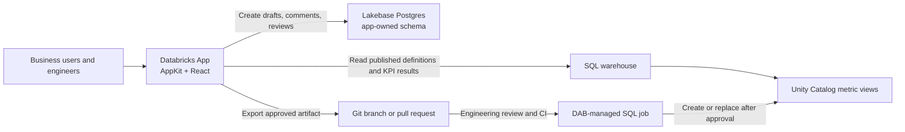

# Proposal: Metric View Collaboration Hub

## Objective

Build a Databricks App that gives business users and data engineers one place to discover governed Unity Catalog metric views, understand their measures and dimensions, propose new metric views or changes through a guided interface, discuss and review drafts, and hand approved definitions to engineering for source-controlled deployment.

The application will not grant business users permission to create or update Unity Catalog objects. Published metric views remain read-only in the app. Drafts, comments, decisions, and approval history are application data until an engineer promotes an approved artifact through the normal engineering workflow.

## Recommended direction

Use a custom Databricks App built with AppKit, TypeScript, and React. This is a workflow application rather than a pure dashboard: it accepts structured input, persists collaboration state, renders governed metrics, and produces engineering artifacts.

Use both of these AppKit data patterns:

| Need | AppKit capability | Data system | Reason |
|---|---|---|---|
| Discover and preview published metric views | `analytics` plugin and `useMetricView` | Unity Catalog through a SQL warehouse | Preserves governed measures and dimensions and their Unity Catalog permissions |
| Store drafts, versions, comments, reviews, and audit history | `lakebase` plugin and server-side routes | App-owned Lakebase Postgres schema | Provides transactional, persistent write-back without writing drafts to Unity Catalog |

This follows the required data-access decision gate. Analytics is the right read path for governed KPI aggregations and browsing. Lakebase is the right write path for collaborative application state. Lakebase synced tables are not needed for the first version because the app does not require sub-second lookup against large Delta tables; that can be revisited if catalog search latency becomes a measured problem.

## Proposed architecture



The browser will never connect directly to Lakebase. AppKit server routes will validate requests and use parameterized Postgres queries. Published metric-view queries will use AppKit's metric-view binding and query path rather than custom warehouse endpoints or raw `SELECT` routes.

## Product scope

### 1. Metric catalog

Provide a repository-style catalog organized by business area. Each entry should show:

- Fully qualified Unity Catalog name and publication status
- Business definition, owner, source, freshness, and last observed update
- Available measures and dimensions, including display names, formats, comments, and synonyms where present
- Example KPI result or small preview query
- Links to active proposals that affect the metric view

Discovery should start from `information_schema` entries whose `table_type` is `METRIC_VIEW`, then load the specific metadata needed for the detail page. Names must be retained exactly as returned by Databricks.

### 2. Metric-view detail and comparison

The detail page should let users understand the published object before requesting a change. It should include definition metadata, measures, dimensions, supported filters, source relationships, and a small governed result preview. A comparison tab should show the published definition next to the latest draft, with field-level additions, removals, and edits.

For a multi-user app, the proposed default is to register metric views with `executor: "user"` so preview results honor each signed-in user's Unity Catalog permissions. This requires the appropriate user API scope and each user to have warehouse and metric-view access. If the organization instead wants every app user to see the same approved aggregate data, the app service-principal execution model can be chosen explicitly during implementation.

### 3. Guided draft builder

The draft builder should capture a structured model rather than asking business users to write YAML. The form should cover:

- Business area, title, purpose, owner, and acceptance criteria
- New metric view versus change to an existing one
- Source fact table and permitted joins
- Dimensions with business labels, descriptions, synonyms, formats, and time semantics
- Measures with business formulas, aggregation intent, units, formats, and expected examples
- Filters, grain, comparability rules, targets, and data-quality expectations
- Rationale, impact, dependencies, and desired delivery date

The application should store the canonical draft as versioned structured JSON in Lakebase. A deterministic server-side generator will render that structure into a complete metric-view YAML/SQL artifact. Generated text remains derived output; users edit the structured fields so validation and diffs remain reliable.

The generator should prevent common semantic errors early: missing source fields, duplicate names, invalid join references, measures used where dimensions are required, inconsistent formats, and incomplete descriptions. Engineering validation will still run against the selected Databricks workspace before an artifact can be marked ready.

### 4. Collaboration and review workflow

Use a clear state machine:

`draft` -> `in_review` -> `changes_requested` or `approved` -> `exported` -> `published`

Only allowed transitions should be accepted by the server. Reviews should support threaded comments tied to the whole proposal or a specific field, named reviewers, resolution status, and an immutable audit event for each state change. An approval records readiness for engineering handoff; it does not write to Unity Catalog.

After deployment, a published record can be linked back to the proposal with the Unity Catalog name, Git commit, deployment run, and publication timestamp. This closes the loop without making the app the deployment authority.

### 5. Engineering handoff

For the first release, produce a downloadable or repository-ready artifact containing:

- Complete metric-view SQL/YAML definition
- Machine-readable draft JSON
- Human-readable change summary and acceptance criteria
- Validation results and example queries
- Metadata needed for a pull request

The preferred production workflow is source control plus a Declarative Automation Bundle. Because DABs do not expose a native metric-view resource, a bundle-managed SQL job can execute the committed definition after code review. Business users remain outside that permission boundary. Direct app-triggered publication should be deferred until governance, approver roles, rollback, and audit requirements are explicitly agreed.

## Persistence model

Create a dedicated Lakebase schema owned by the app service principal. A starting logical model is:

| Entity | Purpose |
|---|---|
| `business_areas` | Domain taxonomy and accountable owners |
| `metric_assets` | Cached references and display metadata for published Unity Catalog metric views |
| `proposals` | New-view or change-request identity, status, priority, and target |
| `proposal_versions` | Immutable structured draft JSON, generated artifact, author, and timestamp |
| `review_assignments` | Reviewers, decisions, and decision timestamps |
| `comments` | Threaded discussion with optional field-level anchors |
| `validation_runs` | Schema, syntax, query, and policy-check results |
| `publication_links` | Git commit/PR, deployment run, and final Unity Catalog object |
| `audit_events` | Append-only record of workflow and permission-relevant actions |

The current version number should be updated transactionally with version creation. Mutations should use optimistic concurrency so one user's stale browser cannot overwrite another user's work.

## UX direction and component plan

Use a repository/analytic hybrid: repository navigation for a large governed catalog, with analytic detail for previews and comparisons. The primary task is to move from discovery to a reviewable proposal without requiring metric-view syntax knowledge.

- **App shell and navigation:** business-area navigation plus search/filter controls, built from published AppKit layout and navigation primitives confirmed against the installed AppKit docs.
- **Metric catalog:** paginated and server-filtered `DataTable`/table presentation with `Badge` status and ownership indicators. Loading uses `Skeleton`, no matches use `Empty` with a useful next action, and failures use `Alert` or an inline error.
- **Metric detail:** `Tabs` for overview, measures, dimensions, preview, lineage/context, and proposals. Use `Card` compositions for key metadata rather than an invented KPI-card component.
- **Result preview:** `useMetricView` with selected measures and dimensions. Every KPI shows unit, period, comparison, freshness, and source. Numeric values are converted from string/null before formatting.
- **Draft builder:** a step-based form composed from documented AppKit input primitives. Show business wording first; place generated YAML/SQL in a read-only, inspectable panel.
- **Review screen:** side-by-side or field-grouped published-versus-draft comparison, threaded comments, unresolved-item count, and explicit review actions.
- **Work queue:** tables for “My drafts,” “Needs my review,” and “Recently published,” with status, age, owner, and next action.

Color will encode status or variance only, using AppKit semantic tokens and chart palettes. Comparable charts will use common scales. Actual, prior, plan, and forecast values will use consistent IBCS-style notation where those scenarios appear. All data surfaces will handle loading, empty, error, and partial/stale states.

## Identity, authorization, and governance

- Databricks Apps provides the authenticated user identity and a dedicated app service principal.
- Published metric-view reads should default to on-behalf-of user execution if access must follow each user's Unity Catalog grants.
- The SQL warehouse must be declared as an app resource with `CAN_USE`; workspace-specific IDs must be injected through resource bindings rather than hardcoded.
- The Lakebase Postgres resource must be declared with `CAN_CONNECT_AND_CREATE`. The app service principal must create and own its dedicated schema during the first deployed startup.
- Application roles such as requester, reviewer, domain owner, and engineer should be enforced server-side. Role mapping may come from Databricks groups or an app-owned mapping after the workspace policy is confirmed.
- Generated definitions are untrusted drafts until validation and engineering approval succeed.
- Secrets and credentials stay in Databricks resource bindings or local uncommitted environment files and never enter the client bundle.

## Delivery plan

### Phase 0: Resolve environment and governance decisions

1. Select one Databricks CLI profile; do not infer it from `DEFAULT`.
2. Confirm the target catalogs/schemas and representative existing metric views.
3. Choose an existing Lakebase project/branch/database or authorize creation of a new project.
4. Confirm on-behalf-of versus shared service-principal reads.
5. Confirm the publication handoff: artifact download, Git pull request, or an existing engineering automation.
6. Agree on the application name, business-area taxonomy, roles, and approval policy.

### Phase 1: Inspect resources and scaffold

1. Use AI tools to obtain the default/running SQL warehouse and query `information_schema` for metric views.
2. Use schema discovery against representative source tables and validate representative metric-view queries.
3. List Lakebase projects, then let the user select a project, branch, and database.
4. Re-run `databricks apps manifest` and merge its template/plugin scaffolding rules.
5. Scaffold with the current manifest's `analytics` and `lakebase` plugins, passing the required warehouse, project, branch, and database resource names and `--run none`.
6. Review generated files before installing additional packages or running the app.

The expected command shape, after the choices above, is:

```powershell
databricks apps init `
  --name <app-name> `
  --features analytics,lakebase `
  --set analytics.sql-warehouse.id=<warehouse-id> `
  --set lakebase.postgres.project=projects/<project-id> `
  --set lakebase.postgres.branch=projects/<project-id>/branches/<branch-id> `
  --set lakebase.postgres.database=projects/<project-id>/branches/<branch-id>/databases/<database-id> `
  --description "Metric view collaboration hub" `
  --run none `
  --profile <selected-profile>
```

Before this command, the selected warehouse must be running. After scaffolding, database migration/connectivity checks and the Analytics type-generation workflow must be completed in the order required by AppKit.

### Phase 2: Build the catalog and read-only metric experience

1. Implement discovery of accessible metric views and bind chosen views in `config/metric-views/definitions.json`.
2. Run type generation before building data-bound React components.
3. Build the catalog, metric detail, governed preview, and required UI states.
4. Test permissions with at least one business user and one engineer persona.

### Phase 3: Build draft persistence and authoring

1. Deploy the empty Lakebase-enabled app once so its service principal creates and owns the application schema before local development.
2. Add migrations/tables, validated server routes, versioning, and optimistic concurrency.
3. Implement the guided builder and deterministic artifact generator.
4. Add field-level validation and a change comparison against an existing metric view.

### Phase 4: Add reviews and engineering handoff

1. Add assignments, comments, state transitions, approvals, and audit history.
2. Add Databricks validation using AI-tools statement/query operations against the selected warehouse.
3. Produce the source-controlled artifact package and connect it to the agreed engineering workflow.
4. Record publication evidence back in the app.

### Phase 5: Validate and deploy

1. Update smoke-test selectors for the finished UI.
2. Run focused unit tests for the generator and workflow state machine, API integration tests for persistence/authorization, AppKit type generation, production build, and `databricks apps validate`.
3. Confirm declared resource permissions and user API scopes.
4. Present the validated build for explicit approval before deployment.
5. Deploy with `databricks apps deploy`, then verify the app reaches `RUNNING` and smoke-test the deployed URL.

## AI-tools and CLI checks planned for implementation

After a profile is selected, use the installed Databricks CLI and AI tools rather than guessing workspace resources:

```powershell
databricks experimental aitools tools get-default-warehouse --profile <profile>
databricks experimental aitools tools query "<information_schema metric-view discovery query>" --profile <profile>
databricks experimental aitools tools discover-schema <catalog.schema.source-table> --profile <profile>
databricks experimental aitools tools statement submit --file <validation.sql> --warehouse <warehouse-id> --profile <profile>
databricks postgres list-projects --profile <profile>
databricks apps manifest -o json
```

All generated metric-view queries must be tested through the CLI before deployment. Measures are selected through `MEASURE(...)`, dimensions are grouped correctly, dimension filters stay in `WHERE`, and measure filters use `HAVING` or an outer query.

## Acceptance criteria for the first usable release

- Users can browse and search accessible published metric views by business area.
- Users can inspect measures, dimensions, definition context, freshness, ownership, and a small governed preview.
- A non-engineer can create a complete structured draft without editing YAML or SQL.
- Every edit creates a recoverable version and every workflow transition is audited.
- Reviewers can comment, request changes, resolve threads, and approve a version.
- The app generates a deterministic, reviewable metric-view artifact and validation report.
- No business-user action directly creates, replaces, or drops a Unity Catalog object.
- Published reads respect the selected identity model and all app resources are declared with least-required permissions.
- The app handles loading, empty, error, stale/partial, and concurrent-edit states.
- Build, type generation, targeted tests, smoke tests, and Databricks Apps validation pass before deployment.

## Decisions required before implementation

The following choices intentionally remain open:

1. **Databricks profile/workspace.** Available valid profiles are `rdelgado-servco-pc`, `ba-workspace`, `hawaii-dev-workspace`, and `hawaii-ba-workspace`. `DEFAULT` currently reports invalid credentials. No profile has been selected.
2. **Lakebase.** Reuse an existing project/branch/database or create a new dedicated project.
3. **Metric scope.** Initial business area, catalog/schema, and two or three representative metric views/source tables.
4. **Read identity.** User-scoped on-behalf-of reads or a shared service-principal view of approved aggregates.
5. **Publication handoff.** Downloadable artifact, Git pull request integration, or connection to an existing bundle/CI process.
6. **MVP boundary.** Whether the first release needs only proposals for existing views or also the full new-view builder with join modeling.

## Evidence consulted

- `seed-1.md`
- Installed Databricks CLI v1.15.0 and its live `apps`, `postgres`, and experimental AI-tools help
- Installed Databricks AI Tools plugin v0.2.10
- Current `databricks apps manifest`, including required resources and scaffolding rules for `analytics` and `lakebase`
- Databricks skills for CLI/core operations, Apps, AppKit data UX, and Unity Catalog metric views
- Live Databricks Developer Hub MCP pages for Databricks Apps, AppKit development, and Lakebase configuration/development

No application code, Databricks resource, database object, workspace query, or deployment was created while preparing this proposal.
